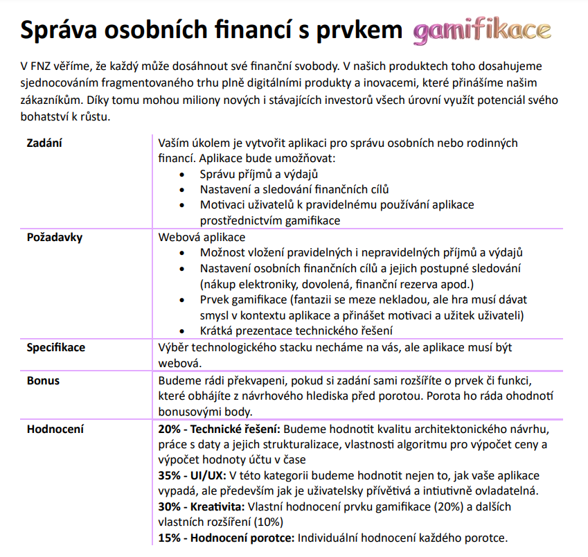
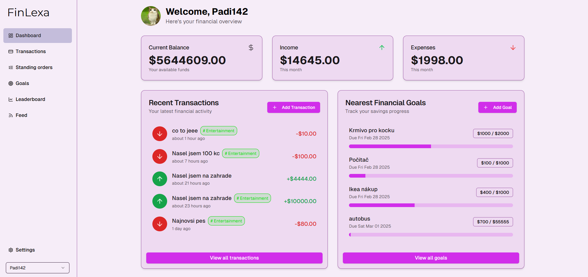
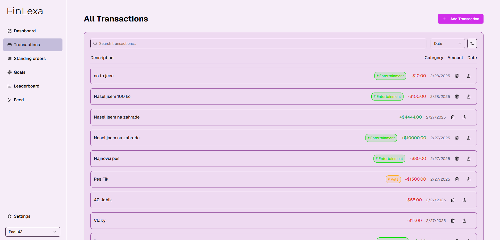
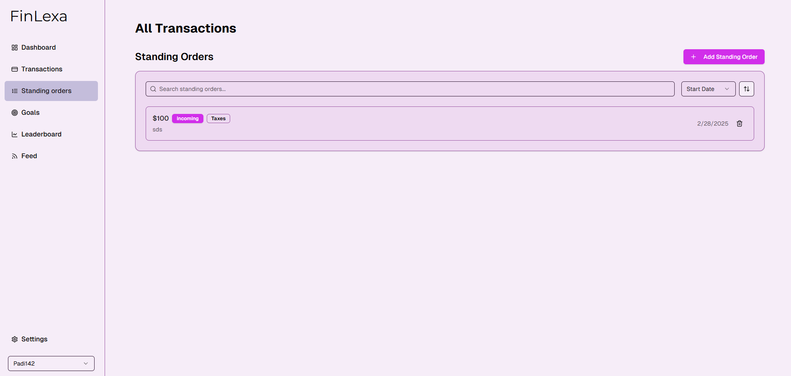
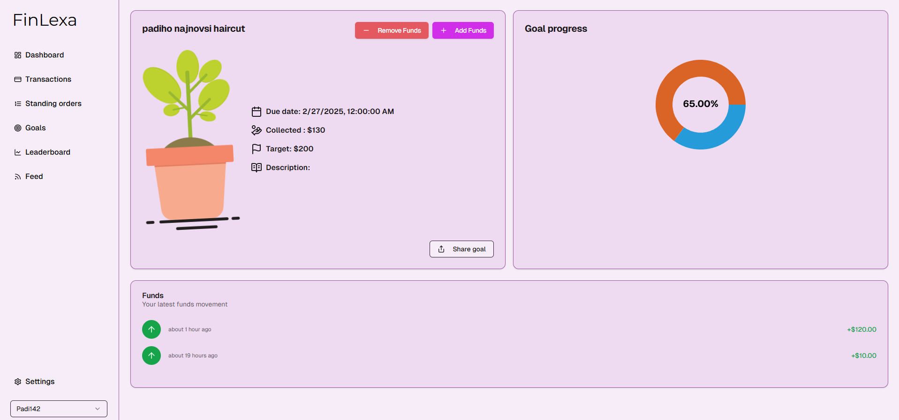
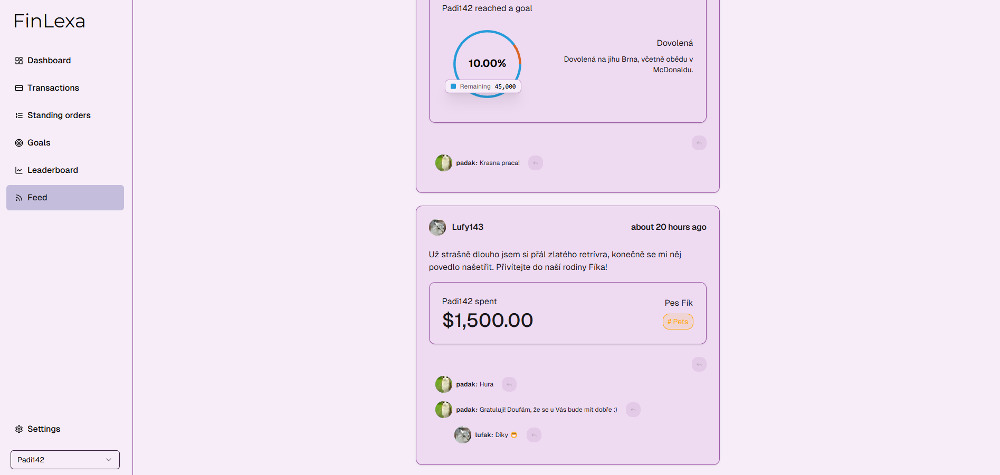
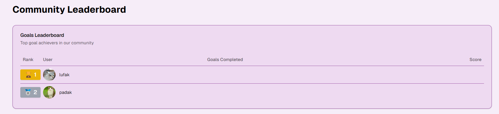
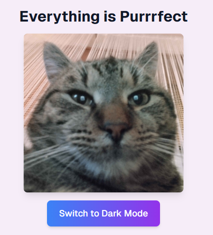

# BSEC 2025

### A Hackathon for BUT Students

**BSEC** is a hackathon designed for students of Brno University of Technology. Within BSEC, we have participated in the **CODE IT! Challenge**, a category focused on coding. This year's assignment was provided by **FNZ**, and the goal was to develop a personal financial management web application with a unique twist—gamification.

---

## Tech Stack

For this project, we utilized the **T3 stack**, along with **shadcn components**, to build our web application efficiently:

- [Next.js](https://nextjs.org)  
- [NextAuth.js](https://next-auth.js.org)  
- [Prisma](https://prisma.io)  
- [Drizzle](https://orm.drizzle.team)  
- [Tailwind CSS](https://tailwindcss.com)  
- [tRPC](https://trpc.io)  

---

## Contributors
Here are the GitHub links of the people that were a part of this team:

- [LufyCZ](https://github.com/LufyCZ)
- [olexamatej](https://github.com/olexamatej)
- [Padi142](https://github.com/Padi142)
- [TheRamsay](https://github.com/TheRamsay)

---

## Our Solution

We have built a **web application** that helps users **manage their personal finances** while making the process engaging through gamification.

### 🌟 Features

#### **1. Dashboard**
A central place to view financial status, displaying:
- **Current balance**
- **Monthly income & expenses**
- **Recent transactions**

#### **2. Transactions Management**
Users can:
- View **all past transactions**
- Set up **automatic recurring transactions**

#### **3. Financial Goals – The "Meadow" Concept**
We introduced a **goal-setting feature**, where users define savings objectives (e.g., buying a new PC). Each goal is represented as a **flower** in their personal **meadow (garden)**. The flower **grows** as the goal progresses.

#### **4. Social Sharing & Engagement**
Users can:
- **Share** their financial goals and transactions with others
- **Comment** on shared goals

#### **5. Leaderboard (Work in Progress)**
A leaderboard to compare **goal completion rates** among users. This allows people to **see others’ goals** and engage in friendly competition.

#### **6. Dark Mode Support**
Because no modern app is complete without it! 🌙

---

## Conclusion
Our web application combines **financial management with gamification**, encouraging users to stay on track with their savings goals in an **interactive and visually engaging** way.

While we didn't get to fully implement the **leaderboard**, the core functionalities—**dashboard, transactions, financial goals, and social sharing**—are all up and running!

🎉 **We had a great time building this, and we hope you like it!**

